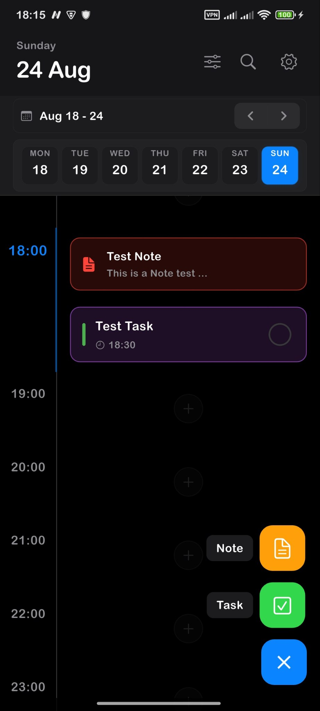
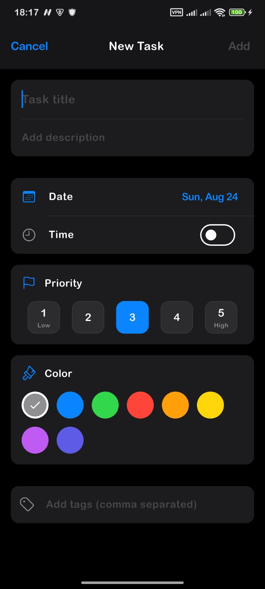
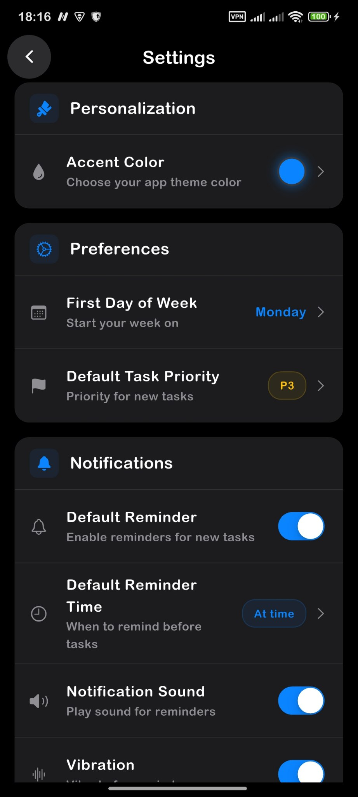

# 🌊 DayFlow: A Modern Task & Habit Tracker

<p align="center">
  <strong>A powerful and customizable open-source task manager built with Flutter.</strong>
  <br>
  DayFlow helps you organize your tasks, track your habits, and manage your day with a beautiful, iOS-inspired interface.
</p>

<p align="center">
  <a href="https://github.com/Aozple/DayFlow/stargazers"></a>
  <a href="https://github.com/Aozple/DayFlow/network/members"></a>
  <a href="https://github.com/Aozple/DayFlow/issues"></a>
  <a href="https://github.com/Aozple/DayFlow/blob/main/LICENSE"></a>
  <br>
  
  
  
</p>

---

## ✨ Key Features

DayFlow is packed with features to boost your productivity and keep you organized.

| Feature                 | Description                                                                                             |
| ----------------------- | ------------------------------------------------------------------------------------------------------- |
| 🕐 **Daily Timeline**   | Visualize your day with an intuitive hourly timeline. Tap any slot to instantly create a task or note.  |
| 🎯 **Habit Tracking**   | Build good habits and break bad ones with a dedicated habit tracking system.                            |
| 📝 **Rich Notes**       | Create detailed notes with Markdown support, complete with a live preview and image attachments.        |
| 🎨 **Highly Customizable** | Personalize your experience with 9 accent colors, dark mode, and a flexible week start day.         |
| 🔔 **Smart Notifications** | Set custom reminders for tasks and habits to stay on track throughout your day.                       |
| 🔍 **Powerful Search**  | Instantly find any task, habit, or note with a fast and efficient search.                               |
| 🔄 **Backup & Restore** | Safeguard your data by exporting it to a file. Easily import it back whenever you need.             |
| 🖼️ **Image Editor**      | Attach images to your notes and edit them on the fly with a built-in, pro-level image editor.         |

---

## 📱 Screenshots

| Timeline                                   | Create Task                                | Settings                                   |
| ------------------------------------------ | ------------------------------------------ | ------------------------------------------ |
|  |  |  |

---

## 🚀 Getting Started

To get a local copy up and running, follow these simple steps.

### Prerequisites

- **Flutter SDK:** Version 3.7.2 or higher. You can find the installation guide [here](https://flutter.dev/docs/get-started/install).

### Installation

1. **Clone the repository:**
   ```sh
   git clone https://github.com/Aozple/DayFlow.git
   ```
2. **Navigate to the project directory:**
   ```sh
   cd DayFlow
   ```
3. **Install dependencies:**
   ```sh
   flutter pub get
   ```
4. **Run the app:**
   ```sh
   flutter run
   ```

---

## 🛠️ Tech Stack & Architecture

DayFlow is built with a modern, scalable tech stack.

- **Framework:** [Flutter](https://flutter.dev/)
- **State Management:** [BLoC](https://bloclibrary.dev/)
- **Database:** [Hive](https://hivedb.dev/) (for a fast, offline-first experience)
- **Navigation:** [GoRouter](https://pub.dev/packages/go_router)
- **Architecture:** The project follows a clean architecture, separating concerns into three main layers: `data`, `presentation`, and `core`.

```
lib/
├── core/           # Shared utilities, services, and constants
├── data/           # Data models, repositories, and data sources
└── presentation/   # UI (Screens/Widgets) and State Management (BLoCs)
```

---

## 🤝 Contributing

Contributions are what make the open-source community such an amazing place to learn, inspire, and create. Any contributions you make are **greatly appreciated**.

1. Fork the Project
2. Create your Feature Branch (`git checkout -b feature/AmazingFeature`)
3. Commit your Changes (`git commit -m 'Add some AmazingFeature'`)
4. Push to the Branch (`git push origin feature/AmazingFeature`)
5. Open a Pull Request

---

## 📄 License

Distributed under the MIT License. See `LICENSE` for more information.

---

## 📬 Contact

Aozple - [@Aozple](https://t.me/Aozple)

Project Link: [https://github.com/Aozple/DayFlow](https://github.com/Aozple/DayFlow)

---

## ❤️ Support

If you find DayFlow useful, please consider giving the repository a ⭐ star!
